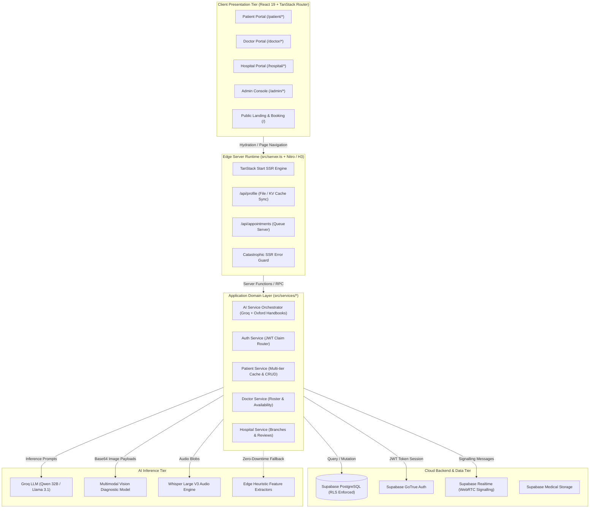

# 🏥 MedDoc — Coha Care Connect (COHA AI)
## Enterprise AI-Powered Healthcare Ecosystem, Telemedicine & Multimodal Clinical Triage Platform

> **Technical Architecture & System Specification**  
> **Version:** 2.2.0 (Edge Runtime & Isomorphic SSR Enabled)  
> **Authored by:** Senior AI Systems & Cloud Architect

---

## 1. Executive Product Overview

**MedDoc (Coha Care Connect)** is an enterprise-grade, full-stack, isomorphic medical SaaS platform engineered to unify clinical operations, AI-assisted symptom triage, multimodal diagnostic image classification, real-time WebRTC telemedicine, digitized lab report analysis, and multi-portal operational workflows into a single cohesive, high-performance system.

The platform provides isolated, role-guarded portals tailored for **Patients**, **Doctors**, **Hospitals**, and **Platform Administrators**:

```
                                  ┌────────────────────────────────────────────────────────┐
                                  │            COHA CARE CONNECT PLATFORM                  │
                                  └────────────────────────────────────────────────────────┘
                                                              │
         ┌────────────────────────┬───────────────────────────┼───────────────────────────┬────────────────────────┐
         ▼                        ▼                           ▼                           ▼                        ▼
  ┌──────────────┐         ┌──────────────┐            ┌──────────────┐            ┌──────────────┐         ┌──────────────┐
  │   PATIENT    │         │    DOCTOR    │            │   HOSPITAL   │            │    ADMIN     │         │   PUBLIC     │
  │   PORTAL     │         │    PORTAL    │            │    PORTAL    │            │   CONSOLE    │         │   LANDING    │
  ├──────────────┤         ├──────────────┤            ├──────────────┤            ├──────────────┤         ├──────────────┤
  │• AI Assistant│         │• Queue Flow  │            │• Department  │            │• User Audit  │         │• Live Roster │
  │• Telemed HD  │         │• HD Video Call│           │  Management  │            │• Analytics   │         │• Service Hub │
  │• Image Scan  │         │• 2-Way Chat  │            │• Doctor Rost.│            │• System Load │         │• Auth Gate   │
  │• Lab Reports │         │• E-Prescribe │            │• Branch Ops  │            │• Compliance  │         │• Pricing     │
  │• ePass Plan  │         │• Roster Slot │            │• Verified Rev│            │• Emergency   │         │• Testimonials│
  │• MedMind Care│         │• Case Notes  │            │• Analytics   │            │• Moderation  │         │• Emergency   │
  └──────────────┘         └──────────────┘            └──────────────┘            └──────────────┘         └──────────────┘
```

---

## 2. Temporary Test Credentials

For evaluation, verification, and live testing across all authenticated portals, use the following pre-configured test credentials:

| Portal Role | Email / Username | Password | Default Redirect Route | Key Test Features |
|---|---|---|---|---|
| **Patient** | `tkavishka101@gmail.com` | `mohan123` | `/patient` | AI Assistant, Live Video Telemed, Lab OCR, Image Scan, ePass, MedMind eCare |
| **Hospital** | `nawalokahospital@hospital.meddoc.com` | `Password123!` | `/hospital` | Hospital Department Roster, Doctor Management, Branch Admin, Reviews |
| **Doctor** | `amara.silva@meddoc.com` | `password123` | `/doctor` | Live Patient Queue, 2-Way Video Consult, Prescription Dispatch, Slot Control |
| **Guest** | *(Unauthenticated)* | *(None)* | `/` | Instant Guest 450 AI Credits, Symptom Assessment, Doctor Search & Booking |

> [!NOTE]
> All accounts above are pre-seeded in the Supabase Authentication table with their respective `user_metadata.role` claims.

---

## 3. Technology Stack & Technical Infrastructure

### Frontend & Client Tier
- **Framework**: [React 19](https://react.dev/) + [TypeScript 5.8](https://www.typescriptlang.org/) (Strict typing, NoEmit zero-error build)
- **Routing & SSR**: [TanStack Router v1](https://tanstack.com/router) & [TanStack Start](https://tanstack.com/start) (Full Isomorphic SSR with client hydration)
- **State Management & Caching**: [TanStack Query v5](https://tanstack.com/query) + Browser BroadcastChannel real-time multi-tab state sync
- **UI Design System**: [Tailwind CSS v4](https://tailwindcss.com/) + [Radix UI Headless Primitives](https://www.radix-ui.com/) + `shadcn/ui` tokens + `lucide-react`
- **Animations & Interaction**: [Motion (Framer Motion 12)](https://motion.dev/)
- **Document & PDF Export**: [jspdf](https://github.com/parallax/jsPDF) + [html2canvas](https://html2canvas.hertzen.com/)

### Server & Edge Runtime Tier
- **Engine**: [Nitro 3](https://nitro.unjs.io/) / [H3](https://github.com/unjs/h3) isomorphic server entrypoint
- **Error Interception**: Global SSR Catastrophic Error Wrapper (`normalizeCatastrophicSsrResponse`)
- **SSR Optimization**: SSR-safe `localStorage` guards (`typeof window !== "undefined"`)
- **Deploy Target**: Vercel Serverless / Cloudflare Edge Workers

### Persistence & Signalling Tier
- **Database**: [Supabase](https://supabase.com/) Managed PostgreSQL 15 with Row Level Security (RLS)
- **Authentication**: Supabase GoTrue Auth (Stateless JWT token claims + session refresh)
- **Real-Time Video**: WebRTC (STUN/TURN signalling over Supabase Realtime Broadcast channels)
- **File Storage**: Supabase Storage Buckets (Medical documents, encrypted attachments, patient avatars)

### AI & Machine Learning Pipeline
- **Primary LLM Reasoning**: [Groq Cloud](https://groq.com/) inference engine running `qwen/qwen3-32b` & `llama-3.1-8b-instant`
- **Multimodal Medical Vision**: Vision-capable models for dermoscopic lesion and fundus retinal classification
- **Speech-to-Text**: `whisper-large-v3` via Groq Audio Transcriptions API
- **Offline ML Models**: Scikit-Learn Random Forest classifiers trained on Wisconsin Breast Cancer and ISIC Dermoscopy benchmarks

---

## 4. System Architecture & C4 Data Flow



---

## 5. Core AI Pipelines & Diagnostic Engines

### 5.1. Conversational Symptom Triage & Intent Engine
The AI assistant (`/patient/assistant`) uses a zero-latency intent classifier coupled with an Oxford Handbook of Clinical Medicine (OHCM) benchmark system prompt.

```
User Input ──► Intent Classifier
                 │
                 ├──► [General Greeting / Inquiry / Gratitude] ──► Empathetic conversational greeting + guided starter chips
                 ├──► [Specialist Booking Request] ────────────► Doctor pool extraction + inline booking redirect
                 ├──► [Image / Report Upload] ────────────────► Route to specialized vision or OCR analyzer
                 └──► [Clinical Symptom Presentation] ─────────► Multi-turn differential diagnosis + risk stratification
```

- **Differential Diagnosis Generation**: Predicts up to 3 candidate conditions with calibrated likelihood percentages (0–100%).
- **Clinical Reasoning Traces**: Emits a transparent `reasoning` trace documenting symptom extraction, differential exclusion, and diagnostic steps.
- **Dynamic Follow-Up Logic**: Dynamically surfaces targeted clarification questions when essential clinical variables (onset, duration, severity) are missing.
- **Agentic Actions**: Emits actionable intents (`book_doctor`, `find_specialist`, `redirect`, `analyze_image`) to navigate users directly to relevant specialist care.

### 5.2. Multimodal Medical Image Analysis (ABCDE Dermoscopy & Retinal Fundus)
Located in `/patient/images`, this module performs clinical evaluation on user-uploaded dermatological, oral, breast, and ocular images.

- **Dermoscopy ABCDE Pipeline**:
  - **A (Asymmetry)**: Symmetry coefficient extraction.
  - **B (Border)**: Regular vs. jagged/notched/blurred margin analysis.
  - **C (Color)**: Multi-spectral variegation tracking (brown, black, blue-gray, red, white).
  - **D (Diameter)**: Estimated millimeter lesion sizing.
  - **E (Evolution)**: Patient-reported temporal lesion changes.
- **Classification Output**: Stratified into `benign`, `malignant`, or `indeterminate` with calibrated `malignancyProbability` and TNM clinical staging references.
- **Fallback Image Engine**: When offline, a pure client-side canvas image processor computes RGB variance, edge contrast frequencies, and pixel density metrics to guarantee continuous operation.

### 5.3. Medical Lab Report OCR & Biomarker Parsing
Located in `/patient/reports` and `/patient/elab`, this subsystem processes diagnostic lab panels (CBC, Lipid Panel, Renal Function, Liver Function, HbA1c, etc.).

- **Biomarker Extraction**: Automatically parses test names, values, units, reference intervals, and LOINC codes.
- **Severity Flagging**: Categorizes each analyte into `normal`, `low`, `high`, or `critical`.
- **Trend Visualization**: Automatically tracks historical test parameters across multiple uploaded reports over time.

### 5.4. MedMind Voice eCare & AI Psychologist Personas
Located in `/patient/medmind-ecare`, this module provides voice-interactive medical guidance and mental health consultations with dedicated persona profiles (`Dr. Nuwan`, `Dr. Ishani`, `Dr. Kavi`).

- **Voice Synthesis & Transcription**: Integrates native Web Speech API and Groq Whisper audio transcriptions.
- **Medication Scheduling**: Calculates remaining pill supplies, automated refill alerts, and daily dosage tracking.

---

## 6. Directory Structure & Architecture Layers

The repository follows a clean, modular, industry-standard architecture:

```
coha-care-connect/
├── public/                         # Static assets (Favicons, images, datasets)
├── scripts/                        # Database seeding, SQL generators & migration tools
│   ├── README.md                   # Documentation for developer utilities
│   ├── seed_hospitals.ts           # Hospital database seeder
│   ├── seed_roster.ts              # Doctor schedule seeder
│   ├── generate_sql.ts             # Migration script generator
│   └── check_db.mjs                # Database connection health check
│
├── src/
│   ├── constants/                  # Single source of truth for constants
│   │   ├── index.ts                # Barrel export
│   │   ├── ai.constants.ts         # Groq model IDs, API endpoints, disclaimer
│   │   ├── medical.constants.ts    # Specialties, blood groups, cities, keyword maps
│   │   └── routes.constants.ts     # Route path string constants
│   │
│   ├── types/                      # Canonical domain TypeScript interfaces
│   │   ├── index.ts                # Barrel export (@/types)
│   │   ├── auth.types.ts           # Role definition ("patient" | "doctor" | etc.)
│   │   ├── doctor.types.ts         # Doctor entity model
│   │   ├── hospital.types.ts       # Hospital entity model
│   │   ├── appointment.types.ts    # Appointment & DbAppointment schemas
│   │   ├── patient.types.ts        # PatientProfile, ReportItem, TimelineItem, ChatSession
│   │   └── ai.types.ts             # Assessment, ImageAnalysis, ReportAnalysis, AgenticAction
│   │
│   ├── services/                   # Application business logic & API orchestrators
│   │   ├── ai/                     # AI sub-module services
│   │   │   └── index.ts            # AI service barrel re-export
│   │   ├── ai.service.ts           # Core AI orchestration layer (Groq + Fallbacks)
│   │   ├── auth.service.ts         # Supabase GoTrue authentication wrapper
│   │   ├── patient.service.ts      # Multi-tier patient data CRUD & sync engine
│   │   ├── doctor.service.ts       # Doctor roster & availability manager
│   │   ├── hospital.service.ts     # Hospital branch & review services
│   │   └── profile.server.ts       # Server-only profile RPC handlers
│   │
│   ├── hooks/                      # Custom React hooks
│   │   ├── index.ts                # Barrel export (@/hooks)
│   │   ├── use-mobile.tsx          # Responsive viewport breakpoint detection
│   │   └── use-webrtc.ts           # WebRTC peer connection & media stream hook
│   │
│   ├── lib/                        # Infrastructure & utilities
│   │   ├── supabase.ts             # Supabase client & admin client initialization
│   │   ├── env.ts                  # Typed, validated environment accessor
│   │   ├── error-reporting.ts      # Global runtime error & telemetry reporting
│   │   ├── error-capture.ts        # Server-side unhandled exception interceptor
│   │   ├── error-page.ts           # Fallback HTML error renderer
│   │   └── utils.ts                # Tailwind CSS class merger (cn)
│   │
│   ├── components/                 # Presentation components
│   │   ├── shared/                 # Cross-portal reusable widgets
│   │   │   ├── DoctorCard.tsx      # Interactive doctor booking card
│   │   │   ├── DoctorProfileDialog.tsx # Comprehensive doctor CV modal
│   │   │   ├── GuestCreditBanner.tsx   # AI credit balance & upgrade banner
│   │   │   ├── LoadingScreen.tsx   # Animated branded splash screen
│   │   │   ├── Logo.tsx            # MedDoc SVG branding
│   │   │   ├── PageHeader.tsx      # Standardized portal view headers
│   │   │   └── RiskBadge.tsx       # Color-coded triage risk pills
│   │   ├── portal/                 # Portal layout shell & navigations
│   │   │   ├── PortalShell.tsx     # Global sidebar, navbar & notification bell
│   │   │   └── navs.ts             # Role-specific navigation manifests
│   │   ├── patient/                # Patient-specific dialogs & cards
│   │   ├── landing/                # Public landing page sections & footer
│   │   └── ui/                     # Accessible shadcn/ui headless components
│   │
│   ├── data/                       # Static mock data & clinical JSON knowledge bases
│   │   ├── mock.ts                 # Pre-seeded doctors, hospitals, and plans
│   │   ├── ai_knowledge.json       # Clinical disease guidelines
│   │   ├── disease_symptoms.json   # 700+ disease-symptom relation graphs
│   │   └── lab_tests.json          # Standard reference ranges & LOINC mapping
│   │
│   ├── routes/                     # File-based TanStack routes
│   │   ├── __root.tsx              # Root HTML shell & query providers
│   │   ├── index.tsx               # Public landing page
│   │   ├── auth.tsx                # Multi-role authentication page
│   │   ├── patient.tsx             # Patient portal shell layout
│   │   ├── patient.index.tsx       # Patient health dashboard
│   │   ├── patient.assistant.tsx   # AI clinical triage assistant chat
│   │   ├── patient.book.tsx        # Appointment booking funnel
│   │   ├── patient.telemedicine.tsx# Live telemedicine video & doctor directory
│   │   ├── patient.reports.tsx     # Medical lab reports reader & trend analysis
│   │   ├── patient.images.tsx      # Medical image cancer scanner
│   │   ├── patient.epass.tsx       # Digital health ePass subscription
│   │   ├── patient.medmind-ecare.tsx # Smart medication & pill reminder
│   │   ├── patient.medifit.tsx     # Health metrics & wellness tracker
│   │   ├── patient.elab.tsx        # Diagnostic lab portal
│   │   ├── patient.timeline.tsx    # Patient medical history timeline
│   │   ├── patient.profile.tsx     # Personal medical profile & records
│   │   ├── doctor.tsx              # Doctor portal shell layout
│   │   ├── doctor.index.tsx        # Doctor dashboard, queue & 2-way telemed
│   │   ├── doctor.profile.tsx      # Doctor schedule & availability configuration
│   │   ├── hospital.tsx            # Hospital portal shell layout
│   │   ├── hospital.index.tsx      # Hospital overview & key metrics
│   │   ├── hospital.doctors.tsx    # Doctor roster management & account invite
│   │   ├── hospital.branches.tsx   # Hospital branch & capacity management
│   │   ├── hospital.profile.tsx    # Hospital profile & facilities
│   │   ├── admin.tsx               # Admin portal shell layout
│   │   └── admin.index.tsx         # Platform admin monitoring & user auditing
│   │
│   ├── server.ts                   # Custom Nitro edge request handler
│   ├── router.tsx                  # TanStack Router instance factory
│   ├── start.ts                    # Server hydration start entrypoint
│   └── styles.css                  # Global Tailwind CSS v4 stylesheets
│
├── package.json                    # Package metadata & scripts
├── tsconfig.json                   # Strict TypeScript compiler options & aliases
└── vite.config.ts                  # Vite, TanStack Start & Nitro bundler config
```

---

## 7. Installation & Local Development Setup

### 7.1. Prerequisites
- **Node.js**: `v20.0.0` or higher ([Download Node.js](https://nodejs.org/))
- **Package Manager**: `npm` (v10+), `pnpm`, or `bun`
- **Git**: Installed and configured

### 7.2. Step-by-Step Installation

```bash
# 1. Clone the repository
git clone https://github.com/kavishkat2002/coha-care-connect.git
cd coha-care-connect

# 2. Install dependencies
npm install

# 3. Create your local environment configuration file
touch .env
```

### 7.3. Configure Environment Variables (`.env`)

Add the following keys to your root `.env` file:

```env
# ─── Supabase Configuration ──────────────────────────────────────────────────
VITE_SUPABASE_URL=https://YOUR_PROJECT_REF.supabase.co
VITE_SUPABASE_ANON_KEY=eyJhbGciOiJIUzI1NiIsInR5cCI6IkpXVCJ9...

# ─── Groq AI Inference Engine ────────────────────────────────────────────────
# Required for Live AI Assistant, Multimodal Vision, and Whisper Transcriptions
# Generate a free key at: https://console.groq.com/keys
VITE_GROQ_API_KEY=gsk_your_groq_api_key_here
```

### 7.4. Running the Development Server

```bash
# Start the local development server with HMR
npm run dev
```

The application will be live at: **`http://localhost:3000`** (or `http://localhost:5173`).

---

## 8. Build, Typecheck & Deployment

### 8.1. Available Scripts

| Command | Description |
|---|---|
| `npm run dev` | Starts the Vite / TanStack Start development server with instant HMR |
| `npm run typecheck` | Executes strict TypeScript static type checking (`tsc --noEmit`) |
| `npm run build` | Compiles client assets and isomorphic server bundle for production |
| `npm run preview` | Previews the production Nitro server build locally |
| `npm run lint` | Runs ESLint across all TypeScript and React source files |
| `npm run lint:fix` | Automatically resolves fixable ESLint formatting and lint issues |
| `npm run format` | Runs Prettier across the entire workspace |

### 8.2. Deploying to Vercel

The application is pre-configured for seamless Vercel deployment:

1. Push your latest code to GitHub (`origin/main`).
2. Import the repository into the **[Vercel Dashboard](https://vercel.com/)**.
3. Set **Framework Preset** to `Vite` (or `Other`).
4. Go to **Settings** → **Environment Variables** and add:
   - `VITE_SUPABASE_URL`
   - `VITE_SUPABASE_ANON_KEY`
   - `VITE_GROQ_API_KEY`
5. Click **Deploy**.

> [!TIP]
> **Production Domain Assignment**: If your preview URL works but your root domain shows an older screen, go to **Vercel** → **Deployments** → click the `...` menu on the latest build → select **"Promote to Production"**.

---

## 9. Database Architecture & Seed Scripts

The project includes pre-built SQL migrations in `supabase_setup.sql` and `supabase_seed.sql` supporting the following primary relational entities:

- `appointments`: Stores scheduled patient visits, consultation modes (`In-person` vs `Telemedicine`), queue tokens, and fee records.
- `patient_profiles`: Stores structured health summaries, allergies, past diagnoses, active prescriptions, and family health history.
- `doctors_roster`: Stores consultant profiles, medical specialties, hospital affiliations, rating metrics, and consultation fees.
- `doctor_availability`: Real-time calendar slot matrices (`TEXT[]` time slots mapped per `doctor_id` and `date`).
- `hospitals` & `hospital_reviews`: Verified medical centers, departments, emergency facilities, and patient review logs.
- `epass_memberships`: Tiered digital health membership subscriptions (`Silver`, `Gold`, `Platinum`) and AI credit allocations.

To run developer seed scripts:
```bash
# Seed hospitals into Supabase
npx tsx scripts/seed_hospitals.ts

# Seed doctor availability rosters
npx tsx scripts/seed_roster.ts
```

---

## 10. Compliance & Clinical Disclaimer

> [!CAUTION]
> **MEDICAL LIABILITY & CLINICAL TRIAGE NOTICE**:  
> MedDoc (Coha Care Connect) is an artificial intelligence-assisted clinical decision support and telemedicine orchestration platform. The diagnostic suggestions, image classifications, and lab analyses generated by the AI models are designed for triage assistance, clinical education, and preliminary risk stratification. They do **not** constitute a formal medical diagnosis or replace consultation with a licensed medical practitioner. In the event of a medical emergency (e.g., severe chest pain, acute dyspnea, sudden neurological deficit), users should immediately contact local emergency services.

---

**License**: Proprietary / Clinical Research License  
**Maintained by**: Lifora Health / Coha Care Connect Architecture Team
