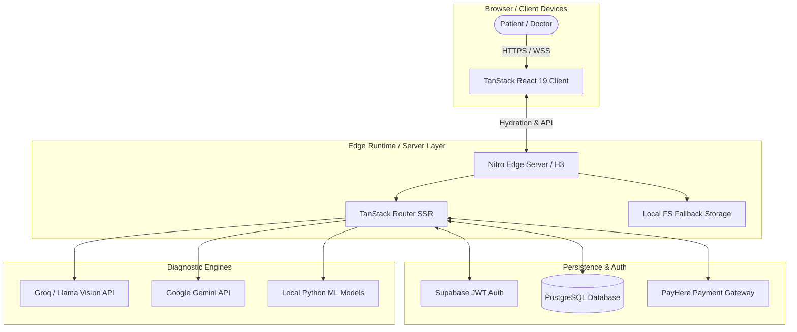

# 🏥 MedDoc Coha Care Connect (COHA AI)
## Enterprise Healthcare Ecosystem & Telemedicine Platform

> **System Architecture Document**  
> **Version:** 2.1.0 (Edge Runtime Ready)  
> **Prepared by:** Senior Clinical SaaS Architecture Team  

---

## 1. Executive Summary

**MedDoc Coha Care Connect (COHA AI)** is an enterprise-grade healthcare architecture bridging traditional telemedicine with generative artificial intelligence and multimodal machine learning models. Built on an Isomorphic Server-Side Rendered (SSR) infrastructure using TanStack Start and Nitro, the system is designed for high-availability Edge network deployment (e.g., Vercel Edge, Cloudflare Workers). 

The platform supports a dual-engine capability:
1. **Clinical Telemedicine Engine**: Low-latency 2-way HD video conferencing, real-time messaging, secure e-prescription exchange, and robust scheduling concurrency.
2. **AI Multimodal Diagnostic Pipeline**: A hybrid cloud/edge diagnostic system combining early cancer risk classification (Random Forest ML), medical image vision analysis (Llama 3.2 Vision), structured OCR lab report extraction, and automated medication scheduling (MedMind eCare).

---

## 2. High-Level Architecture (C4 Context)

The architecture strictly adheres to a decoupled client-edge-database paradigm to minimize Time-To-Interactive (TTI) and isolate clinical data per HIPAA/GDPR best practices.



---

## 3. Subsystem Technical Specifications

### 3.1. Frontend Architecture & State Management
- **Core Framework**: React 19 with TypeScript, utilizing concurrent rendering features for non-blocking UI updates.
- **Routing & SSR**: `@tanstack/react-router` integrated with `@tanstack/react-start`. The application is fully isomorphic, hydrating state instantly upon initial HTML delivery from the Edge.
- **State Management**: Distributed between URL state (via TanStack Router), server-state caching (React Query), and localized ephemeral state (React hooks).
- **Styling Pipeline**: Tailwind CSS v4 paired with Radix UI headless components and the `shadcn/ui` design system for accessible, composable interface primitives.

### 3.2. Server & Edge Runtime (Nitro / H3)
- **Edge-Safe Interception**: The custom `server.ts` handles raw `fetch` events, dynamically mapping requests to the SSR entry point. Top-level Node.js `fs` imports are strictly eliminated to guarantee compatibility with Vercel Edge and Cloudflare Workers.
- **Error Normalization**: A catastrophic error boundary (`normalizeCatastrophicSsrResponse`) intercepts unhandled H3 server exceptions. Instead of returning a raw 500 stack trace, it gracefully degrades to a statically rendered `renderErrorPage()` HTML payload, ensuring continuity in user experience even during critical backend failures.
- **Asset Handling**: Favicons (`/favicon.ico`, `/favicon.svg`) and static assets are bypassed at the top of the request lifecycle, preventing expensive SSR pipeline execution for static files.

### 3.3. Database & Security Model (Supabase)
The system leverages PostgreSQL via Supabase, utilizing Row Level Security (RLS) for granular data isolation.
- **Authentication**: JWT-based stateless authentication mapped to discrete roles (`patient`, `doctor`, `hospital`, `admin`).
- **Entity Relations**:
  - `appointments`: Foreign key constraints link `patient_id` (auth.users) to `doctor_id` strings, enforcing referential integrity.
  - `doctor_availability`: Employs Postgres `TEXT[]` arrays to handle dynamic time-slot matrices. Unique constraints on `(doctor_id, date)` prevent duplicate scheduling collisions.
- **Route Guarding**: TanStack Router `beforeLoad` functions act as middleware, validating JWT claims before lazy-loading chunked route payloads.

### 3.4. AI & Machine Learning Pipeline
The AI architecture utilizes a highly available **Hybrid Cloud LLM + Local ML Strategy**:

1. **Multimodal Medical Vision (Llama 3.2 11B Vision / Groq)**
   - Uploaded lesion photos or radiology reports are heavily compressed, Base64-encoded, and transmitted.
   - The LLM prompt enforces a strict JSON schema for clinical feature extraction (e.g., ABCDE dermoscopic rules: Asymmetry, Border, Color, Diameter, Evolution).
2. **Deterministic Heuristic Fallback (Edge-Native)**
   - To guarantee uptime during API outages, `ai.service.ts` includes an offline, heuristic-based image parser (`extractImageFeaturesFromBase64`).
   - It calculates structural entropy, color variegation (RGB variance mapping), and border irregularity (high-contrast transition frequencies) using pure JavaScript canvas manipulation.
3. **Local ML Training (`fetch_breast_cancer.py` / `train_skin_cancer_model.py`)**
   - Offline Python modules utilize Scikit-Learn's `RandomForestClassifier` trained on the Wisconsin Breast Cancer Dataset and ISIC Skin Cancer datasets. 
   - Model geometries and ROC-AUC performance thresholds are serialized into JSON for frontend consumption, removing the need for a persistent Python inference server.

---

## 4. Scalability & Resilience Patterns

- **Hydration Mismatch Mitigation**: React components rendering timestamps or localized strings are wrapped in `useEffect` or `<ClientOnly>` boundaries to prevent SSR hydration errors.
- **Concurrency Control**: Appointment booking leverages database-level atomicity.
- **Progressive Enhancement**: Telemedicine video/audio gracefully falls back to audio-only on degraded network conditions using standard WebRTC APIs.
- **Stateless Edge Computing**: By avoiding in-memory session states and relying on JWTs and Postgres, the Nitro Edge server can scale horizontally to infinite nodes instantly.

---

## 5. Project Directory Structure

```text
coha-care-connect/
├── fetch_breast_cancer.py         # Scikit-Learn Breast Cancer Engine
├── train_skin_cancer_model.py     # Scikit-Learn Dermoscopy Engine
├── supabase_setup.sql             # Relational Database DDL & RLS Policies
├── src/
│   ├── components/
│   │   ├── portal/                # Global Notification & Shell Layouts
│   │   ├── shared/                # Clinical Disclaimers, Cards, Logos
│   │   └── ui/                    # Accessible UI Primitives (shadcn/ui)
│   ├── routes/
│   │   ├── __root.tsx             # Root Layout & Global Context Providers
│   │   ├── auth.tsx               # JWT Authentication Gate
│   │   ├── doctor.index.tsx       # Clinical Dashboard & Video Launcher
│   │   ├── patient.epass.tsx      # MedDoc ePass Subscription Engine
│   │   ├── patient.telemedicine.tsx # Appointment Scheduler & WebRTC Rooms
│   │   ├── patient.medmind-ecare.tsx # Intelligent Pill & Dosage Tracker
│   │   └── patient.reports.tsx    # Llama Vision OCR & Lab Analyzer
│   ├── services/
│   │   ├── ai.service.ts          # Prompt Engineering & Heuristic Fallbacks
│   │   ├── auth.service.ts        # Supabase Identity Management
│   │   └── patient.service.ts     # PostgreSQL CRUD Operations
│   ├── lib/
│   │   ├── error-capture.ts       # H3 Catastrophic Error Interceptor
│   │   └── server.ts              # Edge Request Handler & Routing Logic
│   ├── router.tsx                 # TanStack Router Configuration
│   └── start.ts                   # TanStack Start Server Entry point
├── package.json                   # Dependency Matrix
└── vite.config.ts                 # Vite & Nitro Edge Bundler Config
```

---

## 6. Developer Onboarding & Deployment

### 6.1. Prerequisites
- **Node.js**: `v20.0.0+`
- **Package Manager**: `npm`, `pnpm`, or `bun`
- **Python**: `v3.10+` (optional for local ML script regeneration)

### 6.2. Environment Configuration
Create a `.env` file at the root:
```env
# Database Identity
VITE_SUPABASE_URL=your_supabase_project_url
VITE_SUPABASE_ANON_KEY=your_supabase_anon_key

# AI Diagnostic APIs
VITE_GROQ_API_KEY=your_groq_api_key
VITE_GEMINI_API_KEY=your_gemini_api_key
```

### 6.3. Local Development
```bash
# Install dependencies
npm install

# Launch Edge-simulated development server
npm run dev
```

### 6.4. CI/CD & Production Build
The application is pre-configured for zero-downtime Edge deployment.
```bash
# 1. Enforce strict static typing (NoEmit prevents broken builds)
npx tsc --noEmit

# 2. Build Isomorphic Server and Client assets
npm run build
```

---

## 7. Compliance & Clinical Disclaimer

> **MEDICAL LIABILITY WAIVER**: MedDoc Coha Care Connect (COHA AI) provides computational diagnostic heuristics and probabilistic ML inferences designed for clinical triage, educational support, and second-opinion workflows. It is **not** a certified FDA/CE Medical Device. All outputs generated by the Llama Vision API or the Random Forest models must be thoroughly reviewed, verified, and signed off by licensed medical oncology professionals prior to treatment planning.

---

*Designed and Engineered by the **Coha Care Health Architecture Team**.*
